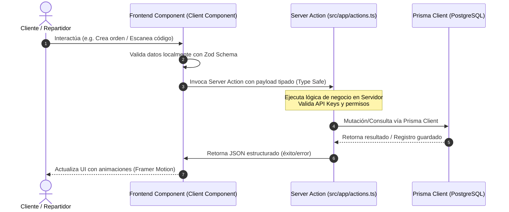

# Implementation Blueprint: Dos Ruedas Pro (Envios DosRuedas)
**Version:** 2.0 (Architectural Blueprint)  
**Framework:** Next.js 16+ (App Router)  
**Database:** Prisma ORM v7 + PostgreSQL  

---

## 1. Page & Navigation Architecture

The navigation model splits into three security/purpose contexts. The frontend is built inside `src/app/` using dynamic routing and layouts.

```mermaid
graph TD
    %% Portales
    Public[🌐 Portal Público - Clientes]
    Admin[🚀 Panel Administración /admin]
    Repartidor[🏍️ Portal Repartidores /repartidor]

    %% Rutas Públicas
    Public --> Home[Inicio /]
    Public --> Contacto[Contacto /contacto]
    Public --> Nosotros[Sobre Nosotros /nosotros/sobre-nosotros]
    Public --> Servicios[Servicios /servicios/*]
    Servicios --> Express[Express /servicios/envios-express]
    Servicios --> LowCost[Low-Cost /servicios/envios-lowcost]
    Servicios --> Flex[Flex MercadoLibre /servicios/enviosflex]
    Servicios --> Emprendedores[Plan Emprendedores /servicios/plan-emprendedores]
    Public --> Cotizar[Cotizador /cotizar/express]
    Public --> Tracking[Seguimiento /seguimiento]

    %% Rutas Administrativas
    Admin --> AdminLogin[Login /admin/login]
    Admin --> AdminDashboard[Dashboard /admin]
    AdminDashboard --> AdminClientes[Clientes /admin/clientes]
    AdminDashboard --> AdminOrdenes[Órdenes /admin/ordenes]
    AdminDashboard --> AdminTarifas[Tarifas /admin/tarifas]
    AdminDashboard --> AdminRepartidores[Repartidores /admin/repartidores]
    AdminDashboard --> AdminEtiquetas[Impresión Etiquetas /admin/etiquetas]

    %% Rutas Repartidor
    Repartidor --> RepartidorSelect[Selección Perfil /repartidor]
    RepartidorSelect --> RepartidorDashboard[Dashboard /repartidor/:id]
    RepartidorDashboard --> RepartidorScanner[Escáner Asignación /repartidor/:id/scanner]
    RepartidorDashboard --> RepartidorRuta[Hoja de Ruta /repartidor/:id/hoja-de-ruta]
```



### 1.1 Page Directory Map
*   `/` (`src/app/page.tsx`): Main landing page. Contains high-fidelity Above-the-Fold rendering (`HeroAnimado`) and Below-the-Fold components.
*   `/servicios/envios-express`: Operations detailing critical immediate deliveries. Fetches dynamic price range matrices from the database.
*   `/servicios/envios-lowcost`: Dynamic comparison tables showing mass route pricing structures.
*   `/cotizar/express`: Google Maps integration allowing customers to type origin/destination, geocode locations, calculate distance, and obtain real-time dynamic pricing.
*   `/contacto`: Interactive client-inquiry forms feeding database records.
*   `/admin`: Protected backend layout requiring admin authorization. Contains interactive CRUD dashboards for orders, prices, couriers, and clients.
*   `/repartidor`: Camera-integrated barcode scanner portal allowing mobile agents to scan printed package labels and add items to their routes.

---

## 2. Data Flow & Prisma Integration

Data mutations and queries strictly operate via **Next.js Server Actions** to avoid exposing raw SQL or direct API endpoints to the client.



### 2.1 Mapeo de Modelos Prisma a Componentes UI

1.  **`PriceRange` ➡️ Calculadora (`src/components/calculator/`)**:
    The pricing engine fetches distance thresholds from the `PriceRange` database table and uses the Google Maps Distance Matrix value to calculate costs.
2.  **`Client` & `Order` ➡️ Formulario de Órdenes (`src/app/admin/ordenes/`)**:
    When an order is created, the system maps the geocoded decimal coordinates (`originLat`/`destinationLat`) to compute distances and automatically matches them to standard client records.
3.  **`Etiqueta` ➡️ Portal Repartidores & Scanner (`src/app/repartidor/`)**:
    The mobile barcode scanner parses standard EAN/code128 numbers matching the `Etiqueta.orderNumber` field, triggering a Server Action to flip status labels (`PENDIENTE` ➡️ `EN_CAMINO`).

---

## 3. Logical Repository Structure for AI Agents

To allow **Google Stitch AI** to map component interfaces to their real database structures and server processes without routing errors, the codebase maintains this directory taxonomy:

```
01EnviosDosRueda/
├── prisma/
│   └── schema.prisma              # DATABASE: Raw schema models (Prisma v7 Client Output target)
├── src/
│   ├── app/                       # ROUTING & PAGES (Next.js App Router)
│   │   ├── actions.ts             # SERVER ACTIONS: All database mutations and business logic
│   │   ├── globals.css            # GLOBAL STYLES: CSS Variables, Print media rules, scrollbar
│   │   ├── page.tsx               # Home landing layout
│   │   ├── admin/                 # Admin restricted routes (dashboard, CRUD tables)
│   │   ├── cotizar/               # Quoting portals (express / lowcost calculators)
│   │   └── repartidor/            # Courier dashboards, sheets, and barcode scanner pages
│   ├── components/                # MODULAR REACT COMPONENTS
│   │   ├── ui/                    # Base visual components (shadcn/ui Buttons, Cards, Inputs)
│   │   ├── homenew/               # Header, Footer, HeroAnimado, and home sub-elements
│   │   ├── calculator/            # Dynamic quoting, Maps views, and price display modules
│   │   ├── contact/               # ContactPageClient component logic
│   │   └── repartidor/            # Camera-based scanning components, routes lists
│   ├── lib/
│   │   ├── prisma.ts              # Global Prisma client instance
│   │   └── utils.ts               # Class merger utility cn()
│   └── types/                     # TypeScript shared declarations
├── docs/                          # DOCUMENTATION
│   ├── DESIGN.md                  # Style guidelines and state behaviors
│   └── BLUEPRINT.md               # Folder navigation and sequence structures
└── tailwind.config.ts             # Tailwind configs (Orbitron/Roboto mapping)
```

---

## 4. Key Rules for Stitch AI Implementations

1.  **Prisma Imports**: Always import from the generated relative path relative to `generated/prisma/client/client` as configured in the generator settings.
2.  **State Transitions**: Component modifications must respect the hover, active, and focus styles declared in `docs/DESIGN.md`.
3.  **A4 Layout Preservation**: Never write arbitrary CSS or hardcoded pixel heights that break the `@media print` directives in `src/app/globals.css`. Ensure containers use elastic Flex properties (`flex-grow`, `flex-shrink`) inside labels layouts.